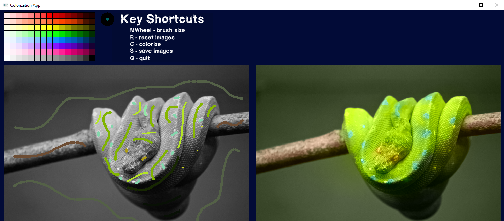

## About the project
Simple tool inspired by [Colorization Using Optimization](https://www.cs.huji.ac.il/~yweiss/Colorization/) with a built-in drawing UI.\
Its purpose is to color any gray image only by marking it with a few scribbles.

## Prerequisites
- numpy
- opencv-python
- scipy
- tqdm

```sh
pip install -r requirements.txt
```
## Usage
Application is executed by `run.py` and has 2 positional arguments (both optional):
- `image_path` - set the path of the image you wish to load, otherwise `example.jpg` is loaded, colored images are automaticaly converted to grey scale
- `scribble_path` - set the path of scribbles, in case you wish to load them

### Examples
```sh
python run.py   
python run.py images/example.jpg
python run.py images/example.jpg images/example_scribble.bmp
```
Note that scribbles should be `.bmp`, otherwise functionality is not guaranteed. Other than that, image formats are not likely to be restricted.

## Application info
- Left image is the one that needs to be scribbled.
- Right image is initially the original image (colored or gray, depends on the input), after process of colorization it is updated.
- Colors can be picked either by clicking on the palette or on the original image, brush size can be changed by rolling the mouse wheel.


#### Shorcuts
- R - reset both images
- C - perform colorization
- S - save both images
- Q - quit the application


## Preview


## Testing
```sh
pytest
```